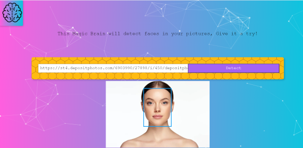
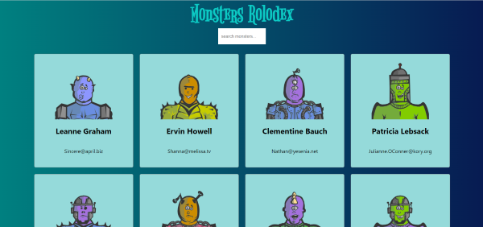

## Advaitam Ayurveda
An e-commerce website was built for a client utilizing Wix and custom code, incorporating a dynamic shopping cart, secure payment gateway integration, and enhanced search functionality. The website was optimized for a seamless shopping experience across desktop and mobile devices.
- 
- Tags: Category 1
- Badges:
  - Javascript [yellow]
  - Wix  [green]
- Buttons:
  - Link [https://www.advaitamayurveda.com]

## Smartbrain
A cutting-edge face detection solution, leveraging an advanced API to precisely identify and locate faces within images. This powerful system effectively detects and analyzes faces, offering valuable insights for diverse applications in biometrics, security, and facial recognition technology.
- 
- Tags: Category 1
- Badges:
  - Html  [orange]
  - Css [red]
  - Javascript [yellow]
  - React  [blue]
  - Clarifai  [green]
- Buttons:
  - Link [https://cerulean-khapse-a60ffd.netlify.app/]

## Robofriends
Discover a world of robots with our innovative app powered by the Robohash API. Explore an extensive collection of unique robots and easily search for specific ones. Unleash your imagination and enjoy the endless possibilities of our robot listing app.
- 
- Tags: Category 2
- Badges:
  - Html  [orange]
  - Css [red]
  - Javascript [yellow]
  - React  [blue]
  - Robohash  [green]
- Buttons:
  - Link [https://strong-paletas-5baa5d.netlify.app/]

