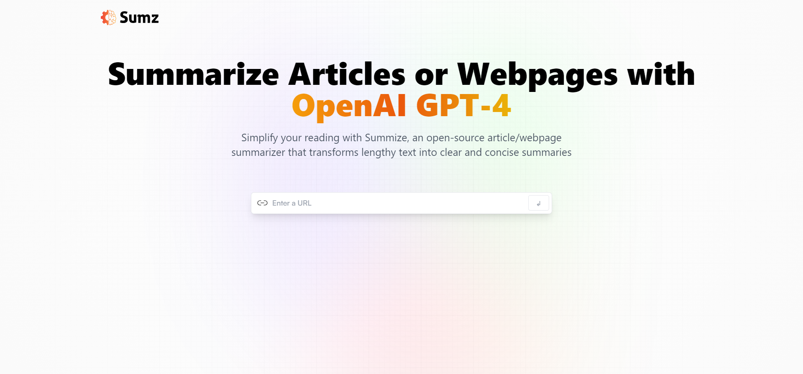

## Food Ordering WebApp
Integrated real Swiggy data for authentic content presentation, enhancing user engagement. Engineered a streamlined Skeleton UI to optimize loading times and smooth transitions, improving user experience. Developed a custom hook for efficient data management, boosting code reusability. Implemented offline state handling for seamless usability in low connectivity scenarios. Strengthened security and user experience with Firebase authentication. Utilized Redux for scalable state management, ensuring consistency across the application.
- 
- Tags: Category 1
- Badges:
  - Html  [orange]
  - Css [red]
  - Javascript [yellow]
  - React  [blue]
  - Firebase  [orangered]
  - Redux [purple]
- Buttons:
  - Link [https://github.com/Aayushsoni09/Swiggy-clone]
  
## Smartbrain
A cutting-edge face detection solution, leveraging an advanced API to precisely identify and locate faces within images. This powerful system effectively detects and analyzes faces, offering valuable insights for diverse applications in biometrics, security, and facial recognition technology.
- 
- Tags: Category 1
- Badges:
  - Html  [orange]
  - Css [red]
  - Javascript [yellow]
  - React  [blue]
  - Clarifai  [green]
- Buttons:
  - Link [https://cerulean-khapse-a60ffd.netlify.app/]
  
## AI SUMMARIZER
Crafted an innovative AI summarizer project leveraging ReactJS and powered by the cutting-edge capabilities of GPT-4. Seamlessly blending advanced natural language processing with intuitive user interface design, this project revolutionizes the way information is distilled. Users can effortlessly generate concise summaries of lengthy text with unparalleled accuracy and efficiency. Through ReactJS, the interface offers a seamless and responsive user experience, while GPT-4's state-of-the-art AI capabilities ensure the highest quality summaries.
- 
- Tags: Category 1
- Badges:
  - Html  [orange]
  - Css [red]
  - Javascript [yellow]
  - React  [blue]
  - GPT4  [green]
- Buttons:
  - Link [https://capable-eclair-3b40c6.netlify.app/]
  
## Robofriends
Discover a world of robots with our innovative app powered by the Robohash API. Explore an extensive collection of unique robots and easily search for specific ones. Unleash your imagination and enjoy the endless possibilities of our robot listing app.
- 
- Tags: Category 2
- Badges:
  - Html  [orange]
  - Css [red]
  - Javascript [yellow]
  - React  [blue]
  - Robohash  [green]
- Buttons:
  - Link [https://strong-paletas-5baa5d.netlify.app/]
  
## Advaitam Ayurveda
An e-commerce website was built for a client utilizing Wix and custom code, incorporating a dynamic shopping cart, secure payment gateway integration, and enhanced search functionality. The website was optimized for a seamless shopping experience across desktop and mobile devices.
- 
- Tags: Category 1
- Badges:
  - Javascript [yellow]
  - Wix  [green]
- Buttons:
  - Link [/]